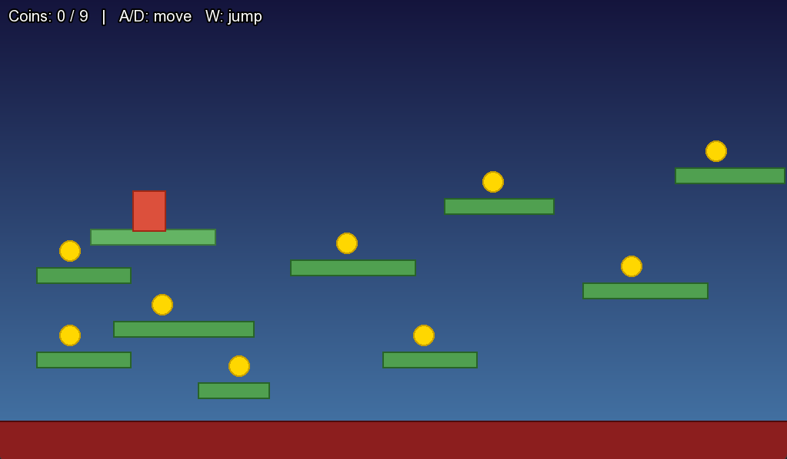

# Red Block Jump
This is a simple platformer game called Red Block Jump, where the user controls the red block object with W for jump, A for left movement, and D for right movement. The objective is to collect all 9 of the coins on the platforms. The project is for those trying to learn about basic SFML implementation.

## Features
- Directional movement controlled by the user
- Automated physics and gravity implementation
- Working SFML application with graphical window generation
- Win screen displayed upon collection of all 9 coins
- Death screen displayed upon touch of the red floor or falling off the map
- Time tracker and coin tracker in the HUD

## Technologies Used
- C++ 17 Standard
- SFML 3.0.2

## Installation
Prerequisites:
- Built with C++ 17 and SFML 3.0.2. No prerequisites required to run the .exe file directly

Steps:
- Download the .exe file
- Run the .exe file

## Usage
After the .exe file has been run, control the red block with W for upward movement (jumping), A for leftward movement, and D for rightward movement. The goal is to collect all 9 golden coins by landing on them with the red block. Avoid falling off the edge or landing on the bottom red floor, because those will result in a death and restart to the level.

## Credits
Built by Avi Craig for Exploration Project #1

